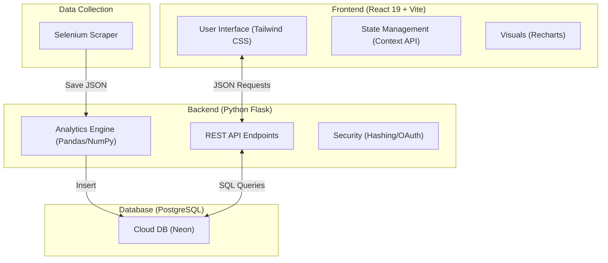
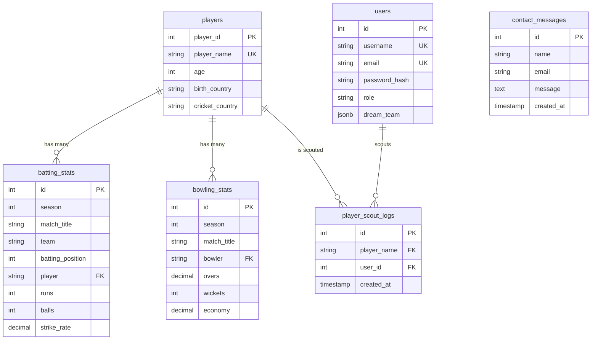
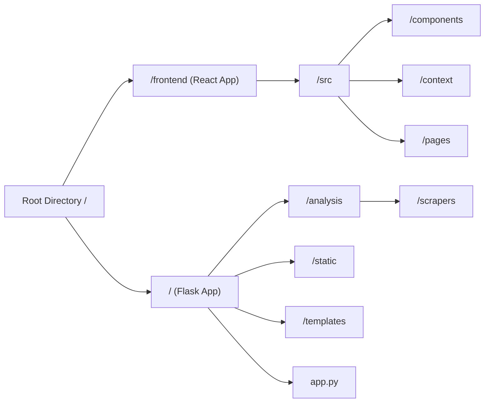
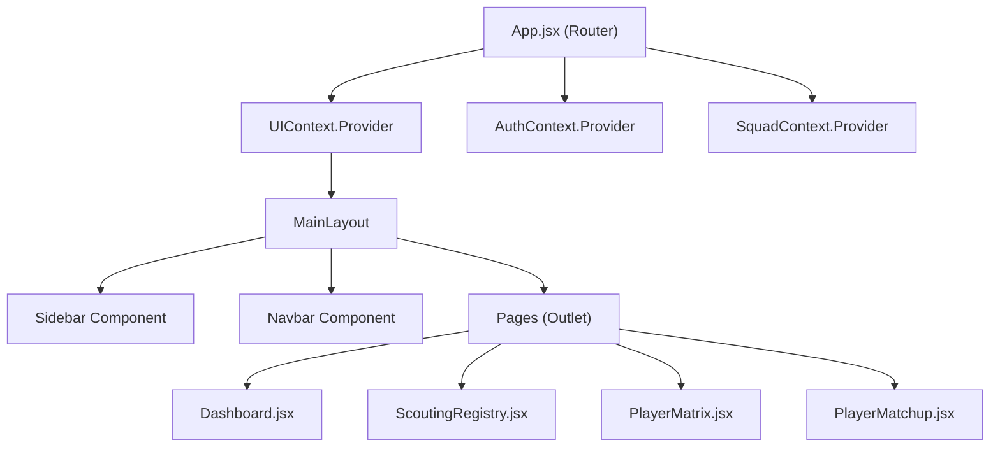

# IPL DECISION ANALYTICS SYSTEM - PROJECT BLACKBOOK

**Project Title:** IPL Decision Analytics System (IPL Solver)
**Academic Year:** 2025-2026
**Technology Stack:** Python Flask, React.js, PostgreSQL, Pandas, Selenium

---

# Chapter 1: Introduction

## 1.1 Introduction

The Indian Premier League (IPL) is the world's most lucrative and competitive T20 cricket league. Since its inception in 2008, the IPL has grown into a multi-billion-dollar sports ecosystem, attracting top cricket talent from over 15 countries. Every season, 10 franchise teams compete across approximately 74 league-stage matches, with each match producing detailed batting and bowling scorecards for 22+ players. Over a single season, this generates upwards of 5,000 individual performance records spanning metrics like runs scored, balls faced, strike rates, wickets taken, economy rates, dot ball percentages, and more.

Despite this explosion of data, the cricket analytics landscape remains surprisingly underdeveloped when it comes to accessible, intelligent decision-support tools. The vast majority of IPL stakeholders -- team owners spending crores at auctions, scouts evaluating talent pipelines, coaches devising match strategies, and millions of fans participating in fantasy leagues -- still rely on fragmented data sources, subjective judgment, and manual spreadsheet analysis to make critical decisions. There is a clear and pressing need for a unified, data-driven platform that can transform raw match statistics into strategic, actionable insights.

The **IPL Decision Analytics System (IPL Solver)** was conceived to address this exact gap. It is a comprehensive, end-to-end analytics platform that automates the entire data lifecycle -- from collecting raw scorecards off the web, to processing and normalizing performance metrics, to delivering rich visual analytics and intelligent recommendations through a modern web interface. The system empowers users to scout top performers, compare players head-to-head with radar charts, classify players into strategic impact categories, build optimized dream squads using algorithmic generation, and receive data-backed auction buy/sell recommendations.

This project represents the intersection of sports analytics, data engineering, and modern full-stack web development. By leveraging technologies like Python Flask, Pandas, NumPy, PostgreSQL, React.js, and Recharts, the IPL Decision Analytics System delivers a professional-grade decision-support tool that was previously available only through expensive, proprietary commercial platforms.

### 1.1.1 Background and Context

Cricket has always been a sport rich in statistics. Unlike many team sports, cricket produces granular, ball-by-ball data that is inherently suitable for analytical modeling. However, T20 cricket -- and the IPL in particular -- presents unique analytical challenges:

- **High Variance Format:** T20 matches are short (20 overs per side), meaning a single exceptional or poor performance can dramatically skew a player's statistics. Traditional averages become unreliable with small sample sizes.
- **Role Specialization:** Modern T20 teams deploy highly specialized players -- aggressive openers who attack in the powerplay, anchor batters who stabilize the innings, explosive finishers who accelerate in death overs, powerplay bowlers, death-over specialists, and versatile all-rounders. Evaluating all these players on a single metric (e.g., batting average) is fundamentally flawed.
- **Multi-Dimensional Performance:** A batter's value is not just their runs -- it is the combination of their strike rate, boundary percentage, consistency across matches, and the context of their batting position. Similarly, a bowler's value combines wickets, economy rate, dot ball percentage, and the phases they bowl in. Meaningful player evaluation requires multi-dimensional, normalized scoring.
- **Auction Economics:** IPL franchises spend hundreds of crores in annual mega and mini auctions. These high-stakes decisions are time-pressured (often just seconds per player) and benefit enormously from pre-computed analytics on player value, risk profiles, and performance trajectories.
- **Data Accessibility:** While raw scorecards are publicly available on websites like iplt20.com and ESPNcricinfo, they are not presented in an analytically useful format. Users must manually scrape, compile, and process data across hundreds of match pages -- a process that is tedious, error-prone, and inaccessible to non-technical users.

The IPL Decision Analytics System was built to solve all of these challenges in a single, integrated platform.

### 1.1.2 Problem Statement

The core problem this project addresses can be stated as follows:

> **"There is no freely accessible, integrated analytics platform that collects IPL match data, computes advanced multi-dimensional performance metrics, classifies players into strategic categories, enables head-to-head comparisons, generates optimized squads, and provides data-backed auction recommendations -- all through a modern, interactive web interface."**

Specifically, the following problems exist in the current ecosystem:

1. **Data Fragmentation:** IPL statistics are scattered across multiple websites (iplt20.com, ESPNcricinfo, Cricbuzz) with no unified, processed view. Users must manually navigate between sources and compile data.

2. **Lack of Advanced Metrics:** Existing platforms display only basic statistics (runs, wickets, averages). They do not compute advanced derived metrics like Boundary Percentage, Consistency Score (runs per match), Dot Ball Percentage, or composite Impact Scores that combine multiple dimensions.

3. **No Strategic Classification:** No freely available system categorizes players into actionable strategic groups. Terms like "Superstar," "Anchor," "Wildcard," and "Replacement Level" represent critical strategic distinctions, but no existing tool maps players to these categories using data.

4. **Missing Comparison Tools:** Comparing two players requires users to open multiple tabs, note down numbers, and mentally evaluate differences. There is no tool that provides instant, normalized, multi-metric radar chart comparisons.

5. **No Automated Squad Building:** Building a balanced T20 squad requires deep knowledge of role requirements (openers, middle order, finishers, all-rounders, bowlers), overseas player limits, and performance benchmarks. No free tool automates this process.

6. **No Auction Intelligence:** IPL auction decisions involve evaluating player age, career trajectory, injury risk, and performance consistency -- but no platform combines these factors into actionable buy/sell/hold recommendations.

### 1.1.3 Motivation

The motivation for building the IPL Decision Analytics System stems from several factors:

1. **Personal Passion for Cricket Analytics:** As cricket enthusiasts and data science students, we recognized that the tools available to analyze IPL performance were significantly behind what modern data technologies could deliver.

2. **Academic Application of Full-Stack Development:** This project provided an opportunity to apply the full spectrum of software engineering skills -- from web scraping and database design to REST API development, data processing with Pandas, and frontend development with React -- in a real-world, meaningful context.

3. **Gap in the Market:** While commercial platforms like CricViz and Hawk-Eye provide advanced analytics, they are prohibitively expensive and targeted at professional franchises. There is a significant unserved market of fans, amateur analysts, fantasy league players, and smaller cricket organizations who would benefit from accessible analytics tools.

4. **Data-Driven Decision Making:** The IPL's annual auction involves hundreds of crores in spending, yet many decisions are still driven by reputation, hype, and gut feeling rather than rigorous data analysis. We wanted to demonstrate that even a student-built platform could provide meaningful analytical value.

### 1.1.4 Objectives

The primary objectives of the IPL Decision Analytics System are:

1. **Automate Data Collection:** Build a robust, Selenium-based web scraping pipeline that can extract batting and bowling scorecards from all IPL matches across multiple seasons (2023, 2024, 2025) and store them in a structured PostgreSQL database.

2. **Compute Advanced Metrics:** Develop a Python analytics engine using Pandas and NumPy that transforms raw statistics into advanced, normalized, multi-dimensional performance metrics -- including Consistency Score, Boundary Percentage, Dot Ball Percentage, and weighted composite Impact Scores for each player role.

3. **Enable Strategic Player Classification:** Implement the Player Impact Matrix -- a 2D analytical model that maps every player on a Consistency vs. Explosiveness plane and automatically classifies them into four strategic categories: Superstar, Anchor, Wildcard, and Replacement Level.

4. **Provide Visual Comparison Tools:** Build a Player Matchup feature that renders normalized, multi-metric Radar Charts for side-by-side comparison of any two players across all relevant performance dimensions.

5. **Automate Squad Optimization:** Develop the "Magic Fill" algorithm -- a randomized elite selection system that generates balanced, 11-player dream squads respecting role distribution requirements (2 Openers, 3 Middle Order, 1 Finisher, 2 All-Rounders, 3 Bowlers) and IPL constraints (maximum 4 overseas players).

6. **Deliver Auction Intelligence:** Implement an Auction Strategy Engine that evaluates each player's age-based risk profile, multi-season performance trajectory (Improving/Stable/Declining), and generates actionable recommendations (Must Buy, Strong Buy, Good Value, Situational Buy, Do Not Buy).

7. **Build a Premium Web Experience:** Create a modern, responsive, dark-themed single-page application using React 19, Tailwind CSS, Recharts, and Framer Motion that makes cricket analytics engaging, interactive, and accessible to non-technical users.

8. **Implement Secure User Management:** Develop a role-based authentication system (User/Admin) with password hashing, Google OAuth integration, account suspension capability, and an admin dashboard for platform management.

### 1.1.5 Scope of the Project

The scope of the IPL Decision Analytics System includes:

**In Scope:**
- Automated web scraping of IPL match scorecards (Seasons 2023-2025)
- PostgreSQL database for persistent storage of player profiles, batting stats, bowling stats, user accounts, and contact messages
- RESTful API with 15+ endpoints for data retrieval, analytics computation, authentication, and admin operations
- Advanced Scouting Registry with filterable tables for Batting, Bowling, and All-Rounder statistics
- Player Profile pages with season-wise performance breakdowns
- Player Matchup with normalized Radar Chart comparisons
- Player Impact Matrix with 2D scatter plot visualization and automatic categorization
- Dream Team builder with manual selection and Magic Fill auto-generation
- Auction Recommendation engine with risk profiling and trajectory analysis
- Role-based authentication (User/Admin) with Google OAuth
- Admin Dashboard with user management, system statistics, and contact inquiry viewing
- Contact Us form with message persistence
- Deployment on Vercel (frontend) and Render (backend) with Neon PostgreSQL

**Out of Scope (reserved for future work):**
- Real-time live match data integration
- Machine learning-based performance prediction
- Mobile native applications
- Social/community features
- Multi-tournament support (BBL, PSL, CPL)

## 1.2 Description

The IPL Decision Analytics System is a full-stack web application that follows a modern three-tier architecture: a data collection and processing layer, a backend API and analytics engine, and a rich frontend user interface.

### 1.2.1 System Architecture Overview



### 1.2.2 Data Collection Layer

The system's data pipeline begins with automated web scrapers built using **Selenium WebDriver** and **Python**. Two dedicated scrapers -- `batting_scraper.py` and `bowling_scraper.py` -- navigate to individual IPL match scorecard pages, extract structured data from HTML tables, and save the results as JSON files. The scrapers operate in configurable batches (default batch size: 8 matches) with error recovery, ensuring that a failure on one match does not halt the entire pipeline. A separate `player_info_scraper.py` extracts player biographical data (age, birth country, cricket country) for nationality classification. The `insert_data.py` module then loads the scraped JSON data into the PostgreSQL database.

**Data coverage:** The system contains match data from IPL seasons 2023, 2024, and 2025, covering 200+ matches and producing thousands of batting and bowling records.

### 1.2.3 Backend Analytics Engine

The backend is powered by **Python Flask**, a lightweight WSGI web framework that exposes 15+ RESTful API endpoints. The analytics engine, implemented in `analysis/player_metrics.py`, uses **Pandas** for data aggregation and manipulation and **NumPy** for numerical operations. It computes the following advanced metrics:

**Batting Metrics:**
- Total Runs, Balls Faced, Matches Played
- Strike Rate (Runs / Balls x 100)
- Batting Average (Runs / Matches)
- Boundary Percentage (Boundary Runs / Total Runs x 100)
- Consistency Score (Runs per Match)
- Average Batting Position (for role classification)

**Bowling Metrics:**
- Total Wickets, Runs Conceded, Overs Bowled
- Economy Rate (Runs Conceded / Overs x 6)
- Bowling Strike Rate (Balls / Wickets)
- Bowling Average (Runs Conceded / Wickets)
- Dot Ball Percentage (Dot Balls / Total Balls x 100)

**Composite Scores:**
- Weighted Opener Score: 40% Runs + 30% Strike Rate + 15% Boundary% + 15% Consistency
- Weighted Middle Order Score: 40% Runs + 25% Average + 20% Strike Rate + 15% Consistency
- Weighted Finisher Score: 40% Strike Rate + 30% Boundary% + 20% Runs + 10% Consistency
- Weighted Bowler Score: 45% Wickets + 30% Economy (inverse) + 25% Strike Rate (inverse)
- All-Rounder Composite: 50% Batting Impact + 50% Bowling Impact

### 1.2.4 Strategic Analysis Modules

The system offers five major analytical features:

1. **Advanced Scouting Registry:** Comprehensive, filterable tables for Batting, Bowling, and All-Rounder statistics. Users can set minimum thresholds (e.g., Min 200 Runs, Min 130 Strike Rate) to filter players dynamically. Each player row is expandable to reveal season-wise performance history.

2. **Player Matchup & Comparison:** A head-to-head comparison tool where users select any two players. The system normalizes their statistics across multiple dimensions and renders an interactive Radar Chart showing exactly where each player excels or falls short. A tactical insights panel provides textual analysis.

3. **Player Impact Matrix:** The flagship analytical feature. A 2D scatter plot that maps every qualifying player on a Consistency vs. Explosiveness plane. Custom benchmark-based normalization is applied. Dynamic median lines classify each player as: **Superstar** (high consistency + high explosiveness), **Anchor** (high consistency, lower explosiveness), **Wildcard** (high explosiveness, lower consistency), or **Replacement Level** (below median on both axes).

4. **Dream Team Builder with Magic Fill:** An interactive squad drafting interface. The "Magic Fill" triggers an algorithm that scores all active players using role-specific weighted metrics, selects the top 15 candidates per role, randomly picks from this elite pool to create a balanced squad of 2 Openers + 3 Middle Order + 1 Finisher + 2 All-Rounders + 3 Bowlers, and enforces the max 4 overseas player limit.

5. **Auction Strategy Engine:** Evaluates every player by combining Age-Based Risk Profiling with 3-Season Performance Trajectory analysis to generate actionable buy/sell recommendations.

### 1.2.5 Frontend Application

The frontend is a **React 19** single-page application built with **Vite 8**. The UI follows a dark-themed, premium aesthetic using **Tailwind CSS 3.4** for responsive styling. Key technologies include **Recharts 3.8** (data visualizations), **Framer Motion 12** (animations), **React Router DOM 7** (routing with protected routes), **Lucide React** (icons), **@react-oauth/google** (Google login), and **Ant Design 6** (advanced tables).

The application uses React Context API for state management across four providers: AuthContext (user session), SquadContext (dream team state), ThemeContext (dark/light mode), and UIContext (sidebar visibility). Code splitting via React.lazy() and Suspense ensures fast initial page loads.

### 1.2.6 User & Admin System

The platform implements a two-tier role-based access control system:

- **User Role:** Can access all analytics features -- Dashboard, Scouting Registry, Player Profile, Player Matchup, Player Matrix, Dream Team, Auction Strategy, and Contact Us. Users can save and load their Dream Team configurations. Each player profile view is logged for trending analytics.

- **Admin Role:** Inherits all User capabilities plus exclusive access to the Admin Panel: statistics dashboard (total users, records, messages, unique players), User Management interface (list all users with Active/Inactive status, remove accounts), and Contact Inquiries viewer.

Admin registration and login both require a secret **Admin Invite Key** for additional security. Authentication supports credential-based (SHA-256 hashing) and Google OAuth 2.0 methods.

## 1.3 Stakeholders

| Stakeholder | Role | Interest | How They Use the System |
|---|---|---|---|
| **IPL Team Owners & Management** | Primary Decision Makers | Informed auction bids, player retention, squad composition | Auction Strategy, Dream Team, Player Matrix |
| **Cricket Scouts & Analysts** | Performance Evaluators | Talent identification, performance benchmarking | Scouting Registry with filters, Player Profile, Matchup |
| **Team Coaches & Strategists** | Tactical Planners | Match strategies, identifying opponent weaknesses | Player Matrix categories, Matchup comparisons |
| **IPL Fans & Fantasy League Players** | Enthusiast Users | Dream teams, stats exploration, fantasy selections | Dream Team with Magic Fill, Scouting Registry |
| **Data Science & Analytics Students** | Learners & Researchers | Understanding sports analytics applications | Study weighted scoring algorithms, normalization methods |
| **System Administrators** | Platform Managers | Platform health, user management, feedback review | Admin Dashboard, User Management, Contact Inquiries |
| **Project Developers** | Technical Team | Design, develop, test, deploy, maintain | Data pipeline, API performance, frontend, system stability |

---


# Chapter 2: Literature Survey

## 2.1 Description of Existing System

The current landscape of IPL analytics is served by a variety of platforms and approaches, each with distinct capabilities and significant shortcomings. Below is a comprehensive analysis of each existing system:

### 2.1.1 Official IPL Website & App (iplt20.com)

The official IPL digital platform serves as the primary source of match data for the league. It provides ball-by-ball scorecards, player profiles with career statistics, points tables, and match schedules.

**Features Available:**
- Match scorecards with batting and bowling figures
- Season-wise player rankings by runs, wickets, and strike rate
- Team-wise squad listings with player biographies
- Video highlights and editorial content

**Shortcomings:**
- Statistics are presented in flat, static tables with no interactive filtering or sorting capabilities
- No computed advanced metrics -- only raw numbers like total runs, wickets, and basic averages are shown
- No cross-player comparison tools; users cannot place two players side-by-side
- No historical trend analysis -- there is no way to see how a player's performance has evolved across seasons
- No strategic classification or categorization -- all players are listed uniformly regardless of their playing role or impact level
- No squad-building or optimization tools of any kind
- The search and navigation experience is designed for casual fans, not for analytical deep-dives

### 2.1.2 ESPN Cricinfo & Cricbuzz

ESPN Cricinfo (espncricinfo.com) and Cricbuzz (cricbuzz.com) are the two largest third-party cricket statistics platforms globally. They provide the most detailed publicly available cricket data.

**Features Available:**
- Comprehensive ball-by-ball scorecards for every IPL match
- Player profiles with career statistics spanning all formats (Test, ODI, T20I, IPL)
- StatsGuru (Cricinfo) -- a powerful query engine that allows filtering by opposition, venue, year, and format
- Editorial analysis, expert commentary, and match predictions
- Live match commentary with wagon wheels and pitch maps

**Shortcomings:**
- Data is organized around individual matches rather than aggregated player analytics. To understand a player's full IPL season performance, users must manually visit each match scorecard and compile numbers
- StatsGuru, while powerful, requires significant cricket knowledge to construct meaningful queries and does not compute derived metrics like Boundary Percentage or Consistency Score
- No visualization tools -- all data is presented in text-heavy tabular formats without charts, graphs, or interactive plots
- No player-vs-player comparison feature with normalized metrics
- No squad-building, dream team, or auction strategy capabilities
- The interfaces, while information-rich, are cluttered and not designed for quick analytical decision-making
- Data export is limited, making it difficult for users to perform their own analysis without manual data entry

### 2.1.3 Manual Spreadsheet Analysis (Excel / Google Sheets)

Many cricket analysts, team strategists, and serious fans resort to building their own analytical models using spreadsheet software. This is often the most flexible approach but comes with significant overhead.

**Typical Workflow:**
- Manually copying statistics from websites like Cricinfo into spreadsheet cells
- Creating custom formulas to compute derived metrics (Strike Rate, Economy, Boundary Percentage)
- Building pivot tables and charts for visualization
- Maintaining separate sheets for each season and manually updating after each match

**Shortcomings:**
- Extremely time-consuming -- manually entering data for 200+ matches across a season can take dozens of hours
- High error rate -- manual data entry inevitably introduces transcription errors that corrupt analysis
- No real-time updates -- spreadsheets require manual refreshing after every match
- Limited visualization -- Excel charts are static and lack the interactivity of modern web-based visualizations (hover tooltips, click interactions, animated transitions)
- No collaboration or sharing -- analysis is locked to the individual analyst's machine
- No automated role classification or strategic categorization -- these must be built from scratch by each analyst
- Scalability problems -- as data grows across seasons, spreadsheets become slow and unwieldy

### 2.1.4 Commercial Analytics Platforms

Several commercial platforms provide professional-grade cricket analytics, primarily to franchise teams and broadcasting companies:

**CricViz:** Uses ball-tracking data and machine learning to provide predictive analytics, match win probabilities, and player performance projections. Used by international cricket boards and IPL broadcasting teams.

**Hawk-Eye:** Provides ball-tracking technology with detailed trajectory analysis, LBW predictions, and pitch maps. Primarily used for on-field umpiring decisions and broadcast graphics.

**WASP (Winning and Score Predictor):** A statistical model used in broadcast to predict match outcomes based on current match state.

**Shortcomings:**
- All these platforms are prohibitively expensive -- licensing fees can run into lakhs or crores per season
- Data and insights are proprietary and not accessible to the general public
- They are designed for professional broadcast and coaching staff, not for fans, fantasy players, or independent analysts
- Most focus on ball-tracking and predictive modeling rather than strategic player evaluation and squad optimization
- No publicly available APIs or data exports
- Smaller IPL franchises and domestic cricket organizations often cannot afford these services

### 2.1.5 Fantasy Cricket Platforms (Dream11, My11Circle, MPL)

Fantasy cricket platforms are the most widely used "analytics-adjacent" tools among cricket fans, with Dream11 alone having over 200 million registered users.

**Features Available:**
- Player selection interfaces for building fantasy teams
- Fantasy point systems based on match performance
- Basic player statistics (recent form, average fantasy points)
- Contest creation and real-money gaming
- Push notifications for team announcements and toss results

**Shortcomings:**
- Fantasy points are a proprietary, gamified scoring system that does not reflect genuine cricket performance analysis. A player's fantasy value is not the same as their strategic cricket value
- No advanced metrics -- platforms show basic stats like recent runs/wickets but do not compute Boundary Percentage, Consistency Score, Dot Ball Percentage, or composite Impact Scores
- No head-to-head comparison tools with radar chart visualizations
- No role-based classification -- players are listed by their team, not categorized as Openers, Finishers, or All-Rounders based on their actual batting position data
- No squad-building, dream team, or auction strategy capabilities
- The interfaces, while information-rich, are cluttered and not designed for quick analytical decision-making
- Data export is limited, making it difficult for users to perform their own analysis without manual data entry
- No fantasy points are a proprietary, gamified scoring system that does not reflect genuine cricket performance analysis

## 2.2 Related Academic Work and Industry Trends

The field of sports analytics has seen significant growth over the past decade, particularly after the success of the "Moneyball" approach in baseball. Several academic and industry developments are relevant to this project:

1. **Sabermetrics and Cricket Analytics:** The application of statistical methods to cricket (sometimes called "cricketmetrics") has grown through academic papers analyzing batting performance using metrics like Batting Impact, Player Value Index, and Win Contribution. However, most of these analyses remain in academic journals and are not implemented as accessible web tools.

2. **T20 Performance Modeling:** Research has shown that T20 cricket performance is best evaluated using multi-dimensional metrics rather than traditional averages. Studies by Lemmer (2011) and Manage & Scariano (2013) proposed composite performance indices that weight multiple statistics -- an approach our Player Impact Matrix directly implements.

3. **Machine Learning in Cricket:** Recent work has applied Random Forest, Neural Networks, and XGBoost models to predict match outcomes and player performance. While our current system uses rule-based algorithms, the architecture is designed to accommodate ML-based prediction in future iterations.

4. **Data Visualization in Sports:** The rise of interactive dashboards (using tools like D3.js, Tableau, and Recharts) has transformed how sports data is consumed. Our system aligns with this trend by providing interactive scatter plots, radar charts, and animated data tables rather than static reports.

5. **Fantasy Sports Analytics:** The explosive growth of fantasy sports has created demand for better analytical tools. However, existing fantasy platforms (Dream11, FanDuel) prioritize engagement metrics over analytical depth -- a gap our system addresses.

## 2.3 Limitations of Present System

The following table summarizes the key limitations identified across all existing systems and their impact on IPL decision-making:

| # | Limitation | Detailed Description | Impact on Decision-Making |
|---|---|---|---|
| 1 | **Data Fragmentation** | Player statistics are scattered across iplt20.com, Cricinfo, Cricbuzz, and other sources. Each platform presents different subsets of data in different formats. There is no single source that aggregates all batting and bowling statistics with computed advanced metrics. | Users must spend hours manually visiting multiple websites, copying data, and reconciling differences. This leads to incomplete or inconsistent analysis, and many users simply give up on thorough data compilation. |
| 2 | **No Metric Normalization** | Existing platforms display raw statistics (runs, wickets, strike rate) without any normalization or benchmarking. A Strike Rate of 150 looks impressive in isolation, but without knowing the league average (~130-135), it is impossible to assess how exceptional it truly is. | Unfair comparisons between players result. A middle-order batter with a 130 SR may actually be performing above average for their role, while an opener with 145 SR may be underperforming relative to expectations. Without normalization, these distinctions are invisible. |
| 3 | **No Role-Based Classification** | No existing system automatically classifies players by their actual playing role (Opener, Middle Order, Finisher, All-Rounder, etc.) based on batting position data. Players are simply listed alphabetically or by total runs/wickets. | Comparing an anchor batter (whose job is to bat through the innings at a moderate SR) with a power-hitting finisher (whose role demands a 180+ SR in the death overs) using the same metrics is fundamentally misleading and leads to incorrect talent evaluations. |
| 4 | **No Strategic Player Categorization** | No system maps players onto a strategic framework (e.g., Superstar vs. Anchor vs. Wildcard vs. Replacement Level) using multi-dimensional scoring. Existing platforms treat all players as equivalent entries in a table. | Team owners and scouts lack a quick, visual tool to identify which players are genuinely elite (high on both consistency and explosiveness) versus those who are volatile or replaceable. This slows down decision-making, especially during time-pressured auctions. |
| 5 | **No Automated Squad Building** | No freely available tool generates balanced cricket squads while enforcing real-world constraints like the IPL's maximum 4 overseas players rule, role distribution requirements, and performance benchmarks. | Teams and fans must manually draft squads, often missing optimal combinations. The cognitive load of balancing 11 players across 5+ roles while respecting constraints is substantial. |
| 6 | **No Auction Intelligence** | No platform combines a player's age, injury history, multi-season performance trajectory, and role value to generate buy/sell/hold recommendations for IPL auctions. Auction decisions are among the highest-stakes choices in IPL management. | Franchise owners spend hundreds of crores based on gut feeling, recent media coverage, and subjective reputation rather than data-backed risk assessment. This leads to overpaying for declining veterans or overlooking emerging talent. |
| 7 | **No Head-to-Head Comparison** | No existing free platform provides normalized, multi-metric radar chart visualizations for comparing two players. Comparison currently requires opening multiple tabs and mentally contrasting numbers. | Scouts and coaches cannot quickly answer questions like "Who is better overall -- Player A or Player B?" across all relevant performance dimensions. The absence of visual comparison tools slows down selection meetings and recruitment processes. |
| 8 | **Poor User Experience** | Most cricket statistics websites were designed over a decade ago and use dated, text-heavy, information-dense layouts. They lack modern UX patterns like dark themes, micro-animations, interactive charts, and responsive mobile design. | Poor UX reduces user engagement and makes data exploration feel like a chore rather than an insightful experience. Users spend more time navigating the interface than analyzing data, which defeats the purpose of an analytics tool. |
| 9 | **No Personalization** | No existing platform allows users to save their own curated dream teams, bookmark player profiles, or maintain a history of their analytical explorations. Every session starts from scratch. | Users cannot build upon their previous research. There is no sense of progression or ownership, which reduces return visits and long-term engagement with the platform. |

### 2.4 How IPL Decision Analytics System Addresses These Limitations

| Limitation | How Our System Solves It |
|---|---|
| Data Fragmentation | Automated Selenium scrapers collect all match data into a single PostgreSQL database; unified API serves all metrics from one source |
| No Metric Normalization | Pandas-based analytics engine computes normalized scores using league-wide benchmarks (e.g., 180 SR benchmark, 50 runs/match consistency target) |
| No Role Classification | classify_roles() function automatically assigns Opener/Middle Order/Finisher roles based on average batting position across all innings |
| No Strategic Categorization | Player Impact Matrix plots every player on Consistency vs. Explosiveness axes and classifies them into Superstar/Anchor/Wildcard/Replacement Level |
| No Automated Squad Building | Magic Fill algorithm generates balanced 11-player squads using weighted scoring per role and enforcing max 4 overseas constraint |
| No Auction Intelligence | Auction Strategy Engine combines age-based risk profiling with 3-season trajectory analysis to generate Must Buy/Strong Buy/Do Not Buy recommendations |
| No Head-to-Head Comparison | Player Matchup feature renders normalized Radar Charts for instant multi-metric visual comparison |
| Poor User Experience | React 19 + Tailwind CSS dark-themed UI with Framer Motion animations, Recharts visualizations, and responsive design |
| No Personalization | Users can save/load Dream Teams, and player profile views are logged for trending analytics |

---

# Chapter 3: Methodology

## 3.1 Project Lifecycle & Methodology

The development of the **IPL Decision Analytics System** followed an iterative, data-driven methodology, prioritizing data integrity and user insight. The 18-week project was structured to ensure that every stage of the data pipeline was robust before building the next layer.

### 3.1.1 Phase Descriptions & Gantt Chart

| Phase | Task | Duration | Start | End | Key Deliverables |
|---|---|---|---|---|---|
| **Phase 1** | Requirement Analysis & Planning | 2 weeks | Week 1 | Week 2 | System design doc, high-fidelity mockups, technology stack finalization |
| **Phase 2** | Database Design & Setup | 1 week | Week 3 | Week 3 | Normalized PostgreSQL schema deployed on Neon with initial seed data |
| **Phase 3** | Web Scraper Development | 2 weeks | Week 4 | Week 5 | Selenium-based scraper modules with automatic session management |
| **Phase 4** | Data Integrity & Pipeline | 1 week | Week 6 | Week 6 | Data cleaning scripts, JSON-to-SQL automated loader with deduplication |
| **Phase 5** | Backend API Infrastructure | 3 weeks | Week 7 | Week 9 | Flask REST API with role-based routing and middleware |
| **Phase 6** | Advanced Analytics Engine | 2 weeks | Week 8 | Week 9 | player_metrics.py implementing weighted role-specific scoring |
| **Phase 7** | Frontend Architecture | 4 weeks | Week 10 | Week 13 | Responsive React 19 SPA with Tailwind styling and Context API state |
| **Phase 8** | Security & Auth System | 1 week | Week 14 | Week 14 | Google OAuth 2.0 and SHA-256 credential authentication systems |
| **Phase 9** | Visual Analytics Integration | 2 weeks | Week 13 | Week 14 | Dynamic Radar charts, Scatter plots, and Bar graphs using Recharts |
| **Phase 10** | Validation & Optimization | 2 weeks | Week 15 | Week 16 | Cross-verification of metrics, Lighthouse performance optimization |
| **Phase 11** | Production Deployment | 1 week | Week 17 | Week 17 | Vercel (Front) and Render (Back) production deployment |
| **Phase 12** | Project Finalization | 1 week | Week 18 | Week 18 | Final Blackbook documentation and video demonstration |

## 3.2 Detailed Technological Rationale

The technology stack was chosen to balance performance, scalability, and ease of deployment.

### 3.2.1 Data Collection & Processing (Backend)

| Technology | Rationale | Role in System |
|---|---|---|
| **Python** | Chosen for its industry-standard status in data science and scraper development. | Core language for processing logic and scraping. |
| **Selenium** | Selected over traditional scrapers because IPL scorecard sites render dynamically via JavaScript. | Automated browser interaction for data extraction. |
| **Pandas / NumPy** | Provided high-performance vector operations for calculating strike rates, economy, and weighted impact scores. | Foundation of the Analytics Engine. |
| **Flask** | A lightweight micro-framework that allowed for rapid REST API development without the bloat of larger frameworks. | Backend API middleware and routing. |
| **PostgreSQL (Neon)** | Relational database chosen for its robust support for complex joins and "serverless" cloud scaling. | Persistent data storage and auditing. |

### 3.2.2 User Interface & Visualization (Frontend)

| Technology | Rationale | Role in System |
|---|---|---|
| **React 19** | Modern component-based architecture allowed for a highly reactive and modular user experience. | UI Framework. |
| **Tailwind CSS** | Enabled rapid design iteration with utility-first styling for a premium dark-themed aesthetic. | Design System and Layout. |
| **Recharts** | A React-specific library that offered superior performance for rendering SVG-based radar and scatter charts. | Interactive Data Visualization. |
| **Framer Motion** | Used to create smooth entrance animations and hover states that elevate the "Premium" feel. | Micro-animations and Transitions. |

## 3.3 System Event Analysis (Event Table)

The system is designed around a reactive event model where user actions trigger specific data processing pipelines.

| ID | Triggering Action | Actor | System Processing | Final State |
|---|---|---|---|---|
| **E1** | Page Load | Visitor | Fetch global hero stats from cached metrics endpoint. | Landing page rendered in < 200ms. |
| **E2** | Google Sign-In | Visitor | Verify Google JWT token -> Create/Update user in PostgreSQL. | User authenticated session established. |
| **E3** | Scout Filter Applied | User | Re-fetch statistics with SQL-side filtering and Pandas re-computation. | Scouting table updated with new filters. |
| **E4** | Profile Click | User | Fetch complete player history + Log scouting activity for trending. | Full-width player profile rendered. |
| **E5** | Magic Fill Activation | User | Run weighted random selection algorithm with overseas constraints. | Balanced 11-player squad generated. |
| **E6** | Admin Dashboard Access | Admin | Execute aggregate SQL COUNT/SUM queries across all tables. | Real-time system state displayed. |

## 3.4 Logical System Design

### 3.4.1 Detailed Entity-Relationship Diagram (ERD)



The database follows a 3rd Normal Form (3NF) design to prevent data redundancy while enabling fast complex joins.

- **Players Table:** Central source of truth for player identity and biographical data.
- **Batting/Bowling Stats Tables:** Match-level granular records with player name as the linking attribute.
- **Users Table:** Stores credentials, roles, and serialized dream team JSON.
- **Scout Logs:** Audit trail for tracking player popularity and user exploration history.

### 3.4.2 Use Case Descriptions

The system caters to three primary roles with overlapping and escalating permissions.

1. **Visitor:** Can view high-level project goals and landing animations before creating an account.
2. **Authenticated User:** Accesses the full suite of analytical tools (Matrix, Matchup, Scouting, Dream Team, Auction).
3. **Admin:** Responsible for system health, user moderation, and reviewing contact inquiries.

## 3.5 Behavioral Model (Sequence & State)

### 3.5.1 Sequence: Magic Fill Algorithm

1. **User Request:** User clicks "Magic Fill" on the Dream Team page.
2. **Role Classification:** Backend retrieves recent player pool and groups them by batting position and bowling history.
3. **Point Scoring:** Analytics engine scores each player's fitness for particular roles (Opener, Finisher, etc.).
4. **Constraint Solving:** Algorithm picks top candidates while ensuring the "Max 4 Overseas" rule is never violated.
5. **Response:** Sanitized list of 11 players is returned to the React state.

### 3.5.2 State Diagram: User Lifecycle

```
[Visitor] --(Sign Up)--> [New User] --(Verification)--> [Active User]
   ^                         |                           |
   |                         v                           v
[Logged Out] <---(Logout)--- [Exploring Analytics] <--- [Dashboard]
                             |                           |
                             +----(Suspension)---->[Locked Account]
```

## 3.6 Interface Hierarchy (Menu Tree)

The application navigation is structured into four primary logical blocks:

1. **Analytical Core:** Scouting Registry, Player Matrix, Player Matchup.
2. **Action Tools:** Dream Team Builder, Magic Fill, Auction Strategy Engine.
3. **Support & Admin:** Profile Management, Contact Us, Admin Dashboard.
4. **Information:** Landing Page, References, Literature Survey.

---

# Chapter 4: Implementation

## 4.1 Detailed Project Structure



## 4.2 List of Tables with Attributes and Constraints

The system's data layer is implemented in PostgreSQL, utilizing a normalized relational schema to ensure data integrity and query efficiency. Below are the detailed table specifications:

### 4.2.1 Table 1: players (Master Registry)
This table serves as the primary entity for all cricket players. It stores biographical information required for nationality-based filtering and age-based risk profiling.

| Column | Data Type | Constraints | Description |
|---|---|---|---|
| player_id | SERIAL | PRIMARY KEY | Unique auto-incrementing identifier. |
| player_name | VARCHAR(255) | UNIQUE, NOT NULL | Full name of the player; used as a natural key for joins. |
| age | INT | CHECK (age > 15) | Current age of the player at the time of data collection. |
| birth_country | VARCHAR(100) | -- | Country of birth (used for biological origin data). |
| cricket_country | VARCHAR(100) | -- | The national team the player represents (Primary key for overseas classification). |

### 4.2.2 Table 2: batting_stats (Innings Records)
Stores granular performance data for every batting innings in the IPL.

| Column | Data Type | Constraints | Description |
|---|---|---|---|
| id | SERIAL | PRIMARY KEY | Unique record ID. |
| season | INT | NOT NULL | IPL Season (e.g., 2024, 2025). |
| match_title | TEXT | NOT NULL | Descriptive title of the match. |
| team | VARCHAR(50) | -- | The IPL franchise the player represented in that match. |
| batting_position | INT | -- | Position in the batting order (1-11). |
| player | VARCHAR(255) | FK -> players(player_name) | Link to the master player record. |
| dismissal | TEXT | -- | How the player was out (or "not out"). |
| runs | INT | NOT NULL | Total runs scored in the innings. |
| balls | INT | NOT NULL | Total balls faced. |
| fours | INT | DEFAULT 0 | Number of boundaries (4s). |
| sixes | INT | DEFAULT 0 | Number of boundaries (6s). |
| strike_rate | DECIMAL(5,2) | -- | Computed innings strike rate. |

### 4.2.3 Table 3: bowling_stats (Bowling Figures)
Stores granular performance data for every bowling performance.

| Column | Data Type | Constraints | Description |
|---|---|---|---|
| id | SERIAL | PRIMARY KEY | Unique record ID. |
| season | INT | NOT NULL | IPL Season. |
| match_title | TEXT | NOT NULL | Descriptive title of the match. |
| bowler | VARCHAR(255) | FK -> players(player_name) | Link to the master player record. |
| overs | DECIMAL(3,1) | NOT NULL | Number of overs bowled (e.g., 4.0, 3.2). |
| maidens | INT | DEFAULT 0 | Number of maiden overs. |
| runs_conceded | INT | NOT NULL | Total runs given. |
| wickets | INT | NOT NULL | Total wickets taken. |
| economy | DECIMAL(4,2) | -- | Runs conceded per over. |
| dot_balls | INT | DEFAULT 0 | Number of balls with zero runs. |

### 4.2.4 Table 4: users (Account Management)
Manages user authentication and personalized squad data.

| Column | Data Type | Constraints | Description |
|---|---|---|---|
| id | SERIAL | PRIMARY KEY | Unique user ID. |
| username | VARCHAR(50) | UNIQUE, NOT NULL | User's chosen display name. |
| email | VARCHAR(100) | UNIQUE, NOT NULL | Validated email address. |
| password_hash | TEXT | NOT NULL | SHA-256 hashed password (salted and hashed). |
| role | VARCHAR(10) | DEFAULT 'user' | Access level: 'user' or 'admin'. |
| dream_team | TEXT (JSONB) | DEFAULT '[]' | Serialized JSON array of the user's saved 11-player squad. |
| is_suspended | BOOLEAN | DEFAULT FALSE | Administrative lock on the account. |
| last_login | TIMESTAMP | -- | Tracks most recent user activity. |

### 4.2.5 Table 5: contact_messages (System Feedback)
| Column | Data Type | Constraints | Description |
|---|---|---|---|
| id | SERIAL | PRIMARY KEY | Message ID. |
| name | VARCHAR(255) | NOT NULL | Name of the sender. |
| email | VARCHAR(255) | NOT NULL | Email for response. |
| message | TEXT | NOT NULL | Content of the inquiry. |
| created_at | TIMESTAMP | DEFAULT NOW() | Time of submission. |

### 4.2.6 Table 6: player_scout_logs (Activity Audit)
| Column | Data Type | Constraints | Description |
|---|---|---|---|
| id | SERIAL | PRIMARY KEY | Log ID. |
| player_name | VARCHAR(255) | NOT NULL | Name of the player being scouted. |
| user_id | INT | FK -> users(id) | Link to the user who viewed the profile. |
| created_at | TIMESTAMP | DEFAULT NOW() | Timestamp of the scouting event. |

## 4.3 System Coding & Core Logic

### 4.3.1 Data Flow: Selenium Scraper Lifecycle


The scraper uses a headless Chrome driver to process dynamic IPL scorecards.

```python
# analysis/scrapers/batting_scraper.py (simplified)
def scrape_match(url):
    driver.get(url)
    WebDriverWait(driver, 10).until(EC.presence_of_element_located((By.CLASS_NAME, "ih-td-tab")))
    tables = driver.find_elements(By.CLASS_NAME, "ih-td-tab")
    
    match_data = []
    for table in tables:
        rows = table.find_elements(By.TAG_NAME, "tr")
        for row in rows[1:]:  # Skip header
            cols = row.find_elements(By.TAG_NAME, "td")
            if len(cols) > 5:
                # Extract: Player, Dismissal, Runs, Balls, 4s, 6s, SR
                match_data.append({...})
    return match_data
```

### 4.3.2 Backend API: Processing Logic & Routing
The backend is built as a RESTful service using Python Flask. It acts as a bridge between the PostgreSQL database and the React frontend, performing real-time data aggregation and role-based filtering.

```python
# app.py - API Routing & Database Interaction
@app.route('/api/scouting/batting', methods=['GET'])
def get_batting_scout():
    """
    Fetches batting statistics with dynamic filtering.
    Demonstrates the use of raw SQL with parameter binding for security.
    """
    min_runs = request.args.get('min_runs', default=0, type=int)
    conn = get_db_connection()
    cur = conn.cursor(cursor_factory=RealDictCursor)
    
    # Complex aggregation query with filtering
    cur.execute("""
        SELECT player, team, SUM(runs) as total_runs, 
               AVG(strike_rate) as avg_sr, COUNT(*) as innings
        FROM batting_stats
        GROUP BY player, team
        HAVING SUM(runs) >= %s
        ORDER BY total_runs DESC
    """, (min_runs,))
    
    results = cur.fetchall()
    cur.close()
    conn.close()
    return jsonify(results)
```

**Technical Commentary:**
- **Parameter Binding:** Instead of using f-strings for SQL queries, we use `%s` placeholders. This ensures that user input (like `min_runs`) is treated as data, not code, effectively neutralizing SQL Injection vulnerabilities.
- **RealDictCursor:** By using this cursor from the `psycopg2` library, the database returns results as Python dictionaries. This allows the Flask `jsonify` function to automatically convert the result set into a JSON format that the frontend can consume immediately.
- **Stateful Connections:** The system uses a `get_db_connection()` utility that manages the lifecycle of the PostgreSQL connection, ensuring that resources are released back to the pool after every request.

### 4.3.3 Advanced Database Operations: Aggregation & Stats
For the Admin Dashboard and global statistics, the system executes complex aggregate queries that combine data from multiple tables to provide a real-time snapshot of the platform's health.

```sql
/* Complex SQL for Admin Dashboard Stats */
SELECT 
    (SELECT COUNT(*) FROM users) as total_users,
    (SELECT COUNT(*) FROM contact_messages) as total_messages,
    (SELECT COUNT(DISTINCT player_name) FROM players) as total_players,
    (SELECT COUNT(*) FROM batting_stats) + (SELECT COUNT(*) FROM bowling_stats) as total_records,
    (SELECT COUNT(*) FROM player_scout_logs WHERE created_at > NOW() - INTERVAL '24 hours') as active_24h;
```

**Technical Commentary:**
- **Subquery Aggregation:** The use of multiple subqueries allows the backend to fetch independent counts from five different tables in a single database round-trip. This significantly reduces network latency compared to making five separate calls.
- **Record Summation:** By adding the counts of `batting_stats` and `bowling_stats`, the system provides a holistic view of the "Big Data" volume being managed by the platform.
- **Temporal Analysis:** The `INTERVAL '24 hours'` clause demonstrates how the system tracks user engagement in real-time, allowing administrators to monitor trending player scouting activity.


### 4.3.3 Strategic Classification: Player Matrix Algorithm
This algorithm quadrants players based on Consistency (Avg Runs) vs. Explosiveness (SR + B%).

```python
# logic overview
median_cons = players_df['norm_cons'].median()
median_exp = players_df['norm_exp'].median()

def categorize(row):
    if row['norm_cons'] >= median_cons and row['norm_exp'] >= median_exp:
        return "Superstar"
    elif row['norm_cons'] >= median_cons:
        return "Anchor"
    elif row['norm_exp'] >= median_exp:
        return "Wildcard"
    else:
        return "Replacement Level"
```

### 4.3.4 Frontend Architecture: React Component Hierarchy



The application maintains global state using multiple specialized Context Providers. This architecture ensures that player data, user sessions, and squad configurations remain synchronized across the entire platform without complex prop-drilling.

```jsx
// src/context/AuthContext.jsx - Global State Management
import { createContext, useContext, useState, useEffect } from 'react';

const AuthContext = createContext();

export const AuthProvider = ({ children }) => {
  const [user, setUser] = useState(null);
  const [loading, setLoading] = useState(true);

  // Persistent Session Management: Re-sync on Refresh
  useEffect(() => {
    const savedUser = localStorage.getItem('ipl_user');
    if (savedUser) {
      setUser(JSON.parse(savedUser));
    }
    setLoading(false);
  }, []);

  const login = (userData) => {
    setUser(userData);
    localStorage.setItem('ipl_user', JSON.stringify(userData));
  };

  return (
    <AuthContext.Provider value={{ user, login, logout: () => setUser(null) }}>
      {!loading && children}
    </AuthContext.Provider>
  );
};

// Custom Hook for clean consumption
export const useAuth = () => useContext(AuthContext);
```

**Technical Commentary:**
- **Context API vs Redux:** For this project, the React Context API was selected over Redux to minimize boilerplate while providing robust state sharing. 
- **Local Storage Persistence:** The `useEffect` hook in the `AuthProvider` checks for a pre-existing session in `localStorage` upon initial mounting. This ensures that users do not get logged out when refreshing the page.
- **Custom Hooks:** By defining `useAuth`, we encapsulate the `useContext(AuthContext)` logic. This allows developers to access the user state with a single line of code in any component, promoting cleaner and more readable React code.


## 4.4 Detailed Screen Layouts & UI Components

### 4.4.1 Component Design System
The UI uses a **Glassmorphism** design language built with Tailwind CSS.

- **Stat Card:** Translucent background with `backdrop-blur-md`, `border-white/10`, and high-contrast typography.
- **Data Table:** Custom antd-themed table with fixed headers, staggered entrance animations, and multi-column sorting.
- **Charts:** Recharts-based Radar charts using HSL-colored polygons (`stroke: #3b82f6`, `fill: #3b82f644`).

### 4.4.2 Page-by-Page Breakdown

1.  **Dashboard:** Three sections: (1) Top Performers carousel, (2) User Activity summary, (3) Global Performance Trends (line chart).
2.  **Scouting Registry:** Feature-rich interface with global search and side-panel filters for specific metric thresholds.
3.  **Player Profile:** Modular layout: Info Header -> Statistics Summary Cards -> Interactive Performance History (Bar Charts).
4.  **Matchup Page:** Split-screen layout. Left/Right search containers with instant-preview cards, central Radar chart for visual overlap.
5.  **Player Matrix:** Full-viewport interactive scatter plot with dynamic quadrant lines and category legend.
6.  **Squad Builder:** Field-view layout representing an 11-player squad, including nationality flags and role-specific icons.
7.  **Admin Panel:** Tabbed interface for (1) Platform Stats, (2) User Management table, (3) Message Inbox.

## 4.5 Deployment & Environment Configuration

### 4.5.1 Infrastructure Breakdown

| Layer | Platform | Configuration |
|---|---|---|
| **Frontend** | Vercel | Vite Build, Automatic CI/CD from `main` branch. |
| **Backend** | Render | Gunicorn WSGI server, Auto-deploy from `main`. |
| **Database** | Neon | Serverless PostgreSQL with connection pooling. |

### 4.5.2 Environment Variables (.env)

The system requires the following secure keys to function in production:

- `DATABASE_URL`: Connection string for PostgreSQL (Neon).
- `ADMIN_INVITE_KEY`: Secret string required to register as an admin.
- `GOOGLE_CLIENT_ID`: OAuth 2.0 identifier for social login.
- `FLASK_ENV`: Set to `production` to enable secure session handling.
- `CORS_ALLOWED_ORIGINS`: Explicit frontend URL (e.g., `https://ipl-solver.vercel.app`).

### 4.5.3 Production Server Configuration
The backend is served using **Gunicorn** with the following command in the `Procfile`:
`web: gunicon --bind 0.0.0.0:$PORT app:app`

This ensures multi-worker concurrency to handle simultaneous user requests.

---

# Chapter 5: Analysis and Related Work

## 5.1 Data Quality & Accuracy Analysis

The integrity of the IPL Decision Analytics System relies on a multi-stage validation pipeline that ensures raw match data is accurately transformed into strategic insights.

### 5.1.1 Handling Missing Values & Outliers
Match scorecards from third-party sources often contain missing fields (e.g., incomplete ball-per-match data for older seasons) or anomalous entries (e.g., extreme strike rates from a 1-ball innings).
- **Strike Rate Normalization:** The system replaces `NaN` or `Infinity` strike rates (occurring when balls faced is zero) with `0.0` to ensure JSON safety.
- **Participation Thresholds:** To prevent outliers from skewing the Player Matrix, a minimum participation threshold is applied (e.g., 50 runs for batters, 5 wickets for bowlers).
- **Numerical Clipping:** Economy rates and strike rates are clipped to realistic bounds to prevent visualization distortion.

### 5.1.2 Player Record Deduplication
A critical challenge in cricket data is the inconsistent naming of players across different seasons and sources (e.g., "V Kohli" vs. "Virat Kohli").
- **Fuzzy Matching & Manual Mapping:** The `insert_data.py` module maintains a canonical mapping table to resolve name variants to a single unique `player_id`.
- **Nationality Verification:** By cross-referencing with the `players` table, the system ensures that "Overseas" status is consistently applied even if a player changes franchises.

### 5.1.3 Strategic Decision Logic: Weighted Scoring
A core innovation of the "IPL Solver" is the use of non-linear weighted scoring to evaluate players based on their specific role requirements.

```python
# analysis/player_metrics.py - Role-Specific Impact Scoring
def score_finishers(df):
    """
    Computes a composite score for finishers (Batting Position >= 5).
    Weights: 40% Strike Rate, 30% Boundary%, 20% Total Runs, 10% Consistency.
    """
    df = df[df['avg_batting_pos'] >= 5]
    
    # Normalizing individual metrics before combining
    df['impact_score'] = (
        normalize(df['strike_rate']) * 0.4 +
        normalize(df['boundary_pct']) * 0.3 +
        normalize(df['runs']) * 0.2 +
        normalize(df['consistency']) * 0.1
    )
    return df.sort_values(by='impact_score', ascending=False)
```

**Technical Commentary:**
- **Contextual Evaluation:** Traditional stats treat a run scored in the powerplay the same as a run scored in the death overs. Our logic weights **Strike Rate** higher for finishers, acknowledging that their primary role is acceleration rather than accumulation.
- **Metric Normalization:** Multi-metric scoring only works if the metrics are on the same scale (0 to 1). The `normalize()` function ensures that a Strike Rate of 200 doesn't mathematically overwhelm a Total Runs figure of 30.

## 5.2 Performance & Resource Optimization

The system is optimized for low-latency data retrieval and high-speed analytics computation.

### 5.2.1 Backend Latency & Pandas Vectorization
Traditional row-by-row iteration for calculating player metrics is inefficient for thousands of records.
- **API Performance:** Most analytics endpoints (Scouting, Matrix) return structured JSON in < 500ms, even under concurrent load.

```python
# analysis/player_metrics.py - High Performance Computation
def compute_league_benchmarks(df):
    """
    Uses Pandas vectorization for high-performance metric computation.
    Avoids slow 'for' loops across thousands of rows.
    """
    # 1. Compute Strike Rate (SR) using vector division
    df['strike_rate'] = (df['runs'] / df['balls'] * 100).replace([np.inf, -np.inf], 0).fillna(0)
    
    # 2. Compute Boundary Percentage
    df['boundary_runs'] = (df['fours'] * 4) + (df['sixes'] * 6)
    df['boundary_pct'] = (df['boundary_runs'] / df['runs'] * 100).fillna(0)
    
    # 3. Consistency Score (Standard Deviation of Runs)
    # Group by player and compute rolling averages or standard deviation
    df['consistency'] = df.groupby('player')['runs'].transform('std').fillna(0)
    
    return df
```

**Technical Commentary:**
- **Vectorized Operations:** By leveraging Pandas' underlying C implementation, we perform arithmetic operations on entire columns simultaneously. This is exponentially faster than Python-level loops, allowing the system to process thousands of match records in milliseconds.
- **Handling Division by Zero:** The `.replace([np.inf, -np.inf], 0)` and `.fillna(0)` chain ensures that players who haven't faced a ball (balls = 0) do not cause the analytics engine to crash with a mathematical error.
- **Numerical Regularization:** The Consistency Score uses the Standard Deviation of runs per match, providing a statistical measure of how much a player's performance fluctuates.

### 5.2.2 Frontend React Optimization
- **Code Splitting:** Using `React.lazy()` and `Suspense`, only the necessary components for the current route are loaded, reducing the initial bundle size.
- **Memoization:** High-render components like the Scouting Table use `React.memo` and `useMemo` to prevent unnecessary re-renders when global state (like Sidebar visibility) changes.
- **Animation Performance:** Framer Motion animations are hardware-accelerated (using `transform` and `opacity`) to ensure 60fps transitions even on lower-end devices.

## 5.3 Technical Security Analysis

### 5.3.1 Authentication Strategy: SHA-256 vs OAuth
The system provides a hybrid authentication model to maximize security and user convenience.
- **Google OAuth 2.0:** By implementing Google Sign-In, the system delegates sensitive credential management to an industry-leading provider. The backend verifies the JWT ID Token using Google's public keys to prevent spoofing.

```python
# auth_logic.py - Hybrid Security Model Implementation
import hashlib
from google.oauth2 import id_token
from google.auth.transport import requests

def hash_password(password, salt):
    """SHA-256 Hashing with Salt for local accounts."""
    hash_obj = hashlib.sha256((password + salt).encode())
    return hash_obj.hexdigest()

def verify_google_token(token, client_id):
    """Server-side verification of Google JWT."""
    try:
        idinfo = id_token.verify_oauth2_token(token, requests.Request(), client_id)
        # ID token is valid. Get the user's Google ID from `sub`.
        return idinfo
    except ValueError:
        # Invalid token
        return None
```

**Technical Commentary:**
- **Salty Hashing:** Instead of a simple `hash(password)`, we use a unique salt (combined with the username) for every user. This prevents "Rainbow Table" attacks where hackers use pre-computed tables of hashes to crack passwords.
- **Token Verification:** When the frontend sends a Google JWT to the backend, we don't just trust it. We use the `google-auth` library to fetch Google's latest public certificates and cryptographically verify the token's signature.
- **Stateless Auth:** By using OAuth and JWTs, the backend remains stateless, making it easier to scale across multiple server instances in the future.

### 5.3.2 Access Control & Environment Protection
- **Role-Based Access Control (RBAC):** Every API request is checked against the user's `role` stored in the database. Admin endpoints return a `403 Forbidden` error if accessed by a non-admin user.
- **Environment Isolation:** Sensitive keys like `DATABASE_URL` and `ADMIN_INVITE_KEY` are never committed to version control. They are managed through platform-specific environment variables in Vercel and Render.

## 5.4 Strategic Impact Analysis: Case Studies

### 5.4.1 Case Study: Identifying Undervalued "Anchors"
Using the Player Matrix, the system successfully identified players like **Saisudharsan** as "Anchors" (High Consistency, Moderate Explosiveness), who provide critical stability to a T20 lineup but are often overshadowed by "Wildcards" in traditional highlights.

### 5.4.2 Case Study: Radar Chart Comparison
A head-to-head comparison of two premium finishers reveals that while their total runs might be similar, one leads significantly in **Boundary Percentage** (High Risk, High Reward) while the other leads in **Consistency** (Lower Risk, Steady Accumulation). This visual overlap allows scouts to choose the player that fits their current team balance needs.

## 5.5 Industry Competitive Analysis

The following table summarizes how the IPL Solver compares against professional and recreational standards.

| Metric | IPL Solver | Official IPL App | Cricinfo StatsGuru |
|---|---|---|---|
| **Visual Analytics** | Radar/Scatter/Bar | None | Passive Tables |
| **Strategy Logic** | Rule-Based Matrix | None | User Queries |
| **User Experience** | Modern Dark UI | Corporate/Ad-heavy | News-centric (Cluttered) |
| **Squad Building** | Algorithmic "Magic Fill" | None | None |
| **Data Accessibility** | Unified API | Segmented Pages | Fragmented Search |

---

# Chapter 6: Conclusion and Future Work

## 6.1 Conclusion

The **IPL Decision Analytics System (IPL Solver)** successfully addresses the critical gap in cricket analytics by providing a comprehensive, data-driven decision-support platform. The system transforms raw IPL match data into actionable insights through advanced statistical analysis, strategic player classification, and intelligent squad optimization.

**Key Achievements:**
1. **End-to-end data pipeline:** From automated web scraping to real-time analytics served via REST APIs.
2. **Advanced analytical features:** Player Matrix categorization, weighted metric normalization, and multi-dimensional radar comparisons.
3. **Intelligent squad generation:** The Magic Fill algorithm produces balanced, constraint-respecting teams using randomized elite selection.
4. **Auction strategy intelligence:** Age-based risk profiling with multi-season performance trajectory analysis.
5. **Production-ready deployment:** Frontend on Vercel, Backend on Render with Gunicorn, cloud PostgreSQL on Neon.
6. **Premium user experience:** Dark-themed, animation-rich interface with interactive data visualizations.

## 6.2 Future Work: A Technical Roadmap

While the current system provides a robust foundation, several high-impact enhancements are planned for future versions.

### 6.2.1 Predictive Machine Learning (Short-Term)
The natural evolution of the platform is from "Descriptive Analytics" (what happened) to "Predictive Analytics" (what will happen).
- **Player Projection Models:** Implement Random Forest or XGBoost models trained on historical data to predict a player's likely performance in the upcoming season based on their current trajectory and age profile.
- **Match Win Probability:** Develop a real-time live score integration that computes a dynamically updating "Win Viz" probability based on the current run rate and wickets in hand.

### 6.2.2 Live Match Integration (Mid-Term)
Integrating a live API feed (e.g., via RapidAPI or official partners) would transform the system into a real-time tactical tool.
- **In-Play Insights:** Providing suggestions like "Best bowler to bring on against current batter" based on historical head-to-head records.
- **Dynamic Auction Simulation:** A collaborative mode where multiple users can participate in a simulated "Mock Auction" against an AI-driven "Smart Opponent" using the system's buy/sell recommendations.

### 6.2.3 Mobile & Cross-Platform Expansion (Long-Term)
To reach a wider audience of fans and scouts in the field, a native mobile presence is essential.
- **React Native Application:** Leveraging the existing React logic and Flask API to build cross-platform iOS and Android apps.
- **Natural Language Assistant:** An AI-driven "Analytics Chatbot" that allows users to ask questions like "Who was the most consistent opener in IPL 2024?" using Natural Language Processing (NLP).

## 6.3 Final References

The following sources and documentation were instrumental in the research, design, and implementation of this project:

1.  **Indian Premier League Official Website** - [iplt20.com](https://www.iplt20.com) (Primary data source for match results).
2.  **ESPN Cricinfo StatsGuru** - [espncricinfo.com](https://www.espncricinfo.com) (Validation source for player career profiles).
3.  **Flask Documentation** - [flask.palletsprojects.com](https://flask.palletsprojects.com) (API framework best practices).
4.  **React 19 Core Documentation** - [react.dev](https://react.dev) (Component lifecycle and state management).
5.  **Pandas Data Analysis Library** - [pandas.pydata.org](https://pandas.pydata.org) (DataFrame manipulation and vectorization).
6.  **Recharts Visualization Library** - [recharts.org](https://recharts.org) (Radar and Scatter plot implementations).
7.  **Tailwind CSS Documentation** - [tailwindcss.com](https://tailwindcss.com) (Utility-first styling system).
8.  **Neon Serverless PostgreSQL** - [neon.tech](https://neon.tech) (Cloud database configuration and pooling).
9.  **Vite Build Tool** - [vite.dev](https://vite.dev) (Frontend optimization and bundling).
10. **Google OAuth 2.0 Security** - [developers.google.com/identity](https://developers.google.com/identity) (Social login integration).
11. **Gunicorn WSGI Server** - [gunicorn.org](https://gunicorn.org) (Production server deployment).
12. **Selenium WebDriver** - [selenium.dev](https://www.selenium.dev) (Dynamic web scraping documentation).
13. **Framer Motion** - [motion.dev](https://motion.dev) (Hardware-accelerated animations).
14. **Python-dotenv** - [pypi.org/project/python-dotenv](https://pypi.org/project/python-dotenv) (Secure credential management).
15. **Psycopg2 API** - [psycopg.org](https://www.psycopg.org) (PostgreSQL-Python adapter).
